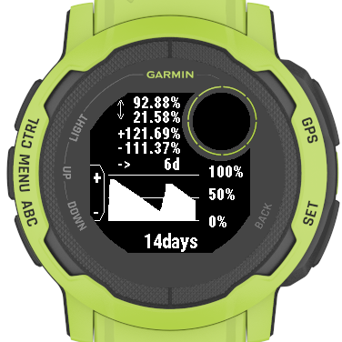

# Garmin Battery Guesstimate

Shows the battery consumption over time and estimates how long the battery would last (better than the build-in estimation).

Connect IQ store link: https://apps.garmin.com/en-US/apps/572b8232-7fb6-4e4f-a938-2395d0df3c7c

For questions, please open an issue or contact me on [twitter](https://twitter.com/INDIVIDUALIT)

## Why do you need it?

I don't know exactly how Garmin predicts how long the battery of a watch would last, but I have been unhappy with that prediction. Specially during power-draining activities the battery on my Instinct2 is drained much quicker than predicted. This app tries to solve that problem.

During a longer activity you can check how much battery charge you have lost so far in the last x minutes/hours and see how long your battery would last if you keep on using it the same way.

Also this app shows you nicely if you have gained any battery charge by solar.

## How it works:

The battery status is collected every 15min and then used to calculate the battery drain between those data-points. The app displays how much the battery was charged/discharged over time (15min - 24h) and calculates how long the battery would last if the battery would be discharged at the same rate like on average during the displayed period.

The prediction is rather pessimistic, so it will always floor decimal results (an estimation of 5.9h will show 5h)

## Screenshots

## Usage
- add the app to your glance carousel
- in the glance view press the GPS button to view details of different time periods
- in the details view use the UP/DOWN buttons to cycle through the different time periods
- in the details view press the GPS button to view the battery graph
- in the graph view use the UP/DOWN buttons to cycle through the different time periods

## supported devices
- Garmin Instinct 2 Series
- Garmin Fenix 6 Series
- Garmin Fenix 7 Series
- Garmin Forerunner 955 Series
- Garmin Descent G1 Series

If you think that tool would be also useful on your device please open an issue or contact me on [twitter](https://twitter.com/INDIVIDUALIT)

## limitations / issues
- only calculates battery change till the last recorded data point not till now (this data can be already nearly 15min old)
- in case the battery is recharged the prediction values become useless. see #16

## future ideas
see: https://github.com/individual-it/BatteryGuesstimate/issues

feel free to open issue if you have more ideas or contact me on [twitter](https://twitter.com/INDIVIDUALIT)
