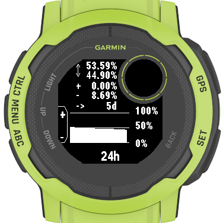

# Garmin Battery Guesstimate

Shows the battery consumption over time and estimates how long the battery would last (better than the build-in estimation).

Connect IQ store link: https://apps.garmin.com/en-US/apps/572b8232-7fb6-4e4f-a938-2395d0df3c7c

For questions, please open an issue or contact me on [twitter](https://twitter.com/INDIVIDUALIT)

## Why do you need it?

I don't know exactly how Garmin predicts how long the battery of a watch would last, but I have been unhappy with that prediction. Specially during power-draining activities the battery on my Instinct2 is drained much quicker than predicted. This app tries to solve that problem.

During a longer activity you can check how much battery charge you have lost so far in the last x minutes/hours and see how long your battery would last if you keep on using it the same way.

Also, this app shows you nicely if you have gained any battery charge by solar.

## Screenshots

## How it works:

The battery status is collected every 15min in the background and this date is used to
1. show the battery charge/discharge over time
2. calculate how long the battery might last
3. show a graph of the battery status

## Usage

- add the app to your glance carousel
- the glance view shows the charge/discharge in the last 15/30 min and prediction based on that data
- in the glance view press the GPS button to view details of different time periods
- in the details view use the UP/DOWN buttons to cycle through the different time periods
- in the details view press the GPS button to view the battery graph
- in the graph view use the UP/DOWN buttons to cycle through the different time periods

### Settings

Use the Connect IQ app to configure the widget.
1. set the time-frames to be displayed in the glance view

## Different predictions of how much longer the battery will last

### 1. Glance and Details View

In the glance and the details view the app compares the latest saved battery state to the selected point in time (e.g 24h in the past), it shows the charge/discharge for that period and predicts how long the battery would last assuming a linear discharge for the selected time frame and for the future.

### 2. Graph View

In the graph view the app accumulates all charging and all discharging for that particular time frame, and besides the graph it shows:
1. the maximum/minimum charge in the selected time frame
2. cumulated charge/discharge for the time frame
3. prediction for how long the battery will last given the discharge in the future will be similar to the cumulated discharge for the selected time frame

### Which prediction is better?

It depends!

The calculation for the glance view and the details view is very quick, but if you have recharged the battery in between it might be useless. E.g. 14 days ago the battery had 60% charge left, during the next 7 days it got discharged down to 10%, then recharged to 100% and is currently standing at 59%. For the time-frame of 14 days the glance and the details view would only check the oldest and newest data point, seeing 1% of discharge over 14days and so calculating a useless high "time left" value.
The algorithm in the graph view is much slower, because every single data-point must be read and calculated, but for the prediction it ignores all charging times, so in the example above it would calculate the time left based on 91% discharge over 14 days.

If you in a battery consuming activity and want to know how long the battery would last in this activity, the glance and details view calculation should be just fine. Also, if your watch recharges during the day by solar, and you assume similar solar input for the future, the glance and details view will give you a good idea about how long the battery will last.

For the case that you have recharged your watch with the cable, or you don't expect much solar input for the future (or your watch does not have solar in the first place) the prediction in the graph view will give you a better idea for a long-term prediction, but it will take longer to get the results.

In both cases the prediction is rather pessimistic, so it will always floor decimal results (an estimation of 5.9h will show 5h)

## supported devices
- Garmin Instinct 2 Series
- Garmin Fenix 6 Series
- Garmin Fenix 7 Series
- Garmin Forerunner 955 Series
- Garmin Descent G1 Series

If you think that tool would be also useful on your device please open an issue or contact me on [twitter](https://twitter.com/INDIVIDUALIT)

## limitations / issues
- only calculates battery change till the last recorded data point not till now (this data can be already nearly 15min old)

## future ideas
see: https://github.com/individual-it/BatteryGuesstimate/issues

feel free to open issue if you have more ideas or contact me on [twitter](https://twitter.com/INDIVIDUALIT)
